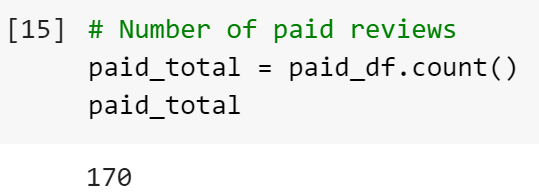
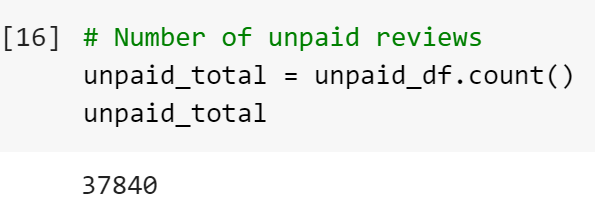
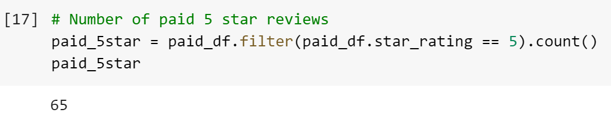
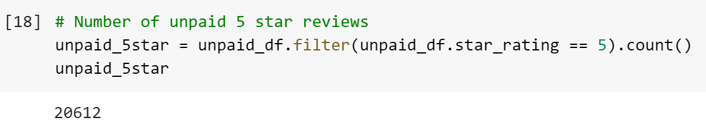
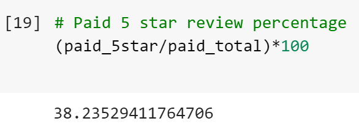
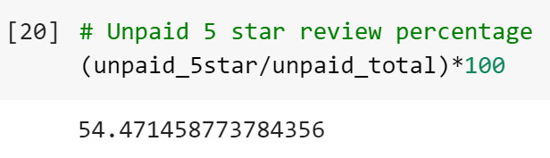

# Amazon Vine Analysis
## Project Overview
The Amazon Vine program is a service that allows manufacturers and publishers to generate reviews for their products. The companies involved pay a small fee to Amazon, and Amazon then provides the companies' products to Amazon Vine members. These Vine members are then required to publish a review on the products. The purpose of this project was to determine if there is any bias toward positive reviews from Vine members. The data set analyzed for this project included Amazon reviews for pet products. 

### Resources 
- Data: [Amazon Review Datasets](https://s3.amazonaws.com/amazon-reviews-pds/tsv/index.txt), [Pet Product Review Dataset](https://s3.amazonaws.com/amazon-reviews-pds/tsv/amazon_reviews_us_Pet_Products_v1_00.tsv.gz)     
- Software: Google Colab Notebook, PostgreSQL, pgAdmin, AWS

## Results
- The number of non-Vine reviews far exceeded the number of Vine reviews.  

        
      

- The number of 5-star non-Vine reviews greatly exceeded the number of 5-star Vine reviews.

       
      

- The non-Vine reviews had a higher percentage of 5-star reviews than the Vine reviews. 

        
       

## Summary
